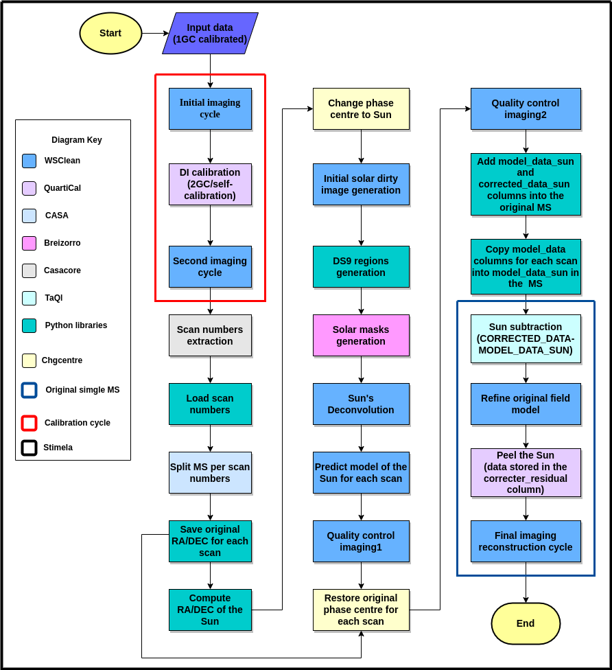

Welcome to SolarKAT documentation!
===================================

.. .. image:: sftp://samboco@garfunkel.ru.ac.za/home/samboco/solarkat_docs/docs/source/solarlogo.png
..   :alt: SolarKAT Logo
..   :align: center

Overview
--------

The **SolarKAT** is a Python-based pipeline designed for MeerKAT observations affected by the Sun. It addresses the challenge of solar radio interference in the observed data. The pipeline employs solar tracking, subtraction, and peeling techniques to enhance data quality by significantly reducing solar radio interference. This is achieved while preserving the flux measurements in the main field. The versatility of the pipeline makes it applicable not only to general radio astronomy observations but also to solar radio astronomy. Additionally, the generated solar images can be utilized for weather forecasting purposes. 

The SolarKAT flowchart is ilustrated below:
 
.. The Solar Interference Mitigation Pipeline is a Python-based pipeline designed to mitigate solar radio interference in MeerKAT data. It employs solar tracking, solar subtraction, and peeling techniques to enhance the quality of data by reducing solar radio interference while preserving flux measurements in the observed field. The Solar Interference Mitigation Pipeline is a versatile tool designed to enhance data quality for radio astronomers, specifically addressing challenges posed by solar interference. It not only improves data quality for general radio astronomy observations but also provides valuable data for solar radio astronomy. Additionally, the solar images generated by the pipeline can contribute to weather forecast modeling.

.. Check out the :doc:`usage` section for further information, including
.. how to :ref:`installation` the project.

\

Audience
--------
This documentation is intended for radio astronomers and data scientists interested in utilising the pipeline to recover the affected visibilities and improve the data image quality for future analysis. This is also a valuable tool for space weather scientists intended to utilise the pipeline to produce solar images for weather forecasting.

.. note::

   This project is under active development.

Contents
--------

.. toctree::

   introduction
   overview
   installation
   usage
   solarkat_steps
   softwares
   api